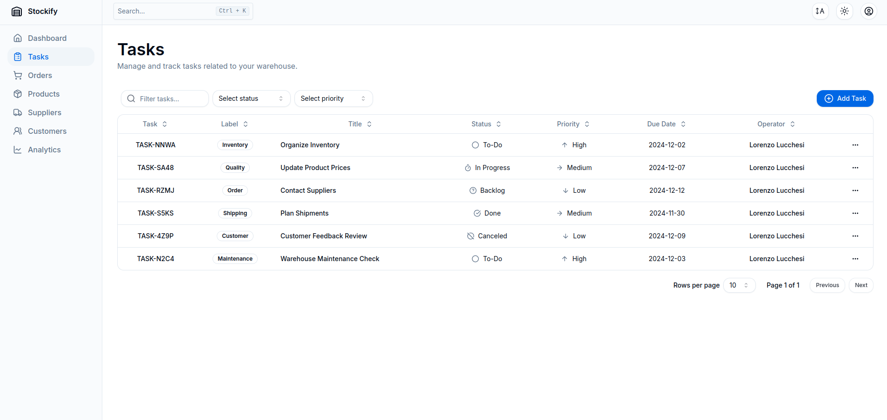

# Stockify


## Overview

Stockify is a warehouse management system designed to simplify inventory management for warehouse workers. It provides an intuitive interface for adding new products, reordering stock, creating orders, monitoring inventory statistics, and much more.

_Note: The application supports both light and dark modes, enhancing user experience._

## Features

### 1. **Dashboard**

- Real-time updates on key warehouse metrics.
- Track the total inventory value, low-stock products, pending orders, and total products in stock.
- Activity logs displaying recent actions, such as order creation and stock updates.


### 2. **Orders**

- Place orders for products already in inventory.
- View order status, receipts, and the total number of orders placed in the current month and week.
- See the total value of each order.




### 3. **Products**

- Add new products with associated categories, prices, and quantities (min/max).
- Filter and sort products by category or status (Available/Archived).
- Edit existing product information or remove products from the inventory.


### 4. **Analytics**

- Visual charts and graphs provide insightful inventory data:

  - **Product Categories**: A pie chart showing the distribution of products by category.
  - **Monthly Inventory Value**: A line chart illustrating the inventory value trend over time.
  - **Top 5 Highest Value Products**: A bar chart highlighting the top 5 products by total value.


### 5. **Settings**

- Manage account settings, including adding or updating account information.


### 6. **Sign Up / Log In**

- **User Authentication:** Users can easily create an account or log in to access the dashboard. The signup and login forms are designed to be user-friendly, ensuring a smooth onboarding experience.
- **Secure Access:** The application utilizes secure authentication methods to protect user data, ensuring that sensitive information remains private.


## Tech Stack

Stockify is built using modern and efficient web technologies:

- **Front-end**:
  - [React](https://reactjs.org/) for building user interfaces.
  - [Tailwind CSS](https://tailwindcss.com/) for utility-first styling.
  - [Shadcn/ui](https://ui.shadcn.com/) for pre-built, customizable UI components.
- **Back-end**:
  - [Next.js](https://nextjs.org/) for handling backend logic.
  - [Auth.js](https://authjs.dev/) for authentication and authorization.
- **Database**:
  - [Prisma](https://www.prisma.io/) as the database ORM.
- **Form Management and Validation**:
  - [React Hook Form](https://react-hook-form.com/) for efficient form management.
  - [Zod](https://zod.dev/) for schema validation.
- **Date Manipulation**:
  - [date-fns](https://date-fns.org/) for date manipulation.
- **Charts**:
  - [Recharts](https://recharts.org/en-US/) for visual data representation.
- **Date Picking**:
  - [React Day Picker](https://react-day-picker.js.org/) for date selection in forms.
- **CSV Export**:
  - [React CSV](https://github.com/react-csv/react-csv) for exporting data to CSV files.
- **Type Safety**:
  - [TypeScript](https://www.typescriptlang.org/) for type safety and code quality.

## Getting Started

### Prerequisites

- [Node.js](https://nodejs.org/en/) (v16 or higher)
- [Git](https://git-scm.com/)

### Installation

1. **Clone the repository**:

   ```bash
   git clone https://github.com/lucchesilorenzo/stockify.git
   cd stockify
   ```

2. **Install dependencies**:

   ```bash
   npm install
   ```

3. **Set up environment variables**:
   Create a `.env` file at the root of the project with the following values:

   ```bash
   DATABASE_URL="file:./dev.db"
   AUTH_SECRET="your-auth-secret" # You can generate one with `openssl rand -base64 32`
   ```

4. **Run database push**:

   ```bash
   npx prisma db push
   ```

5. **Run database seed**:

   ```bash
   npx prisma db seed
   ```

6. **Start the development server**:
   ```bash
   npm run dev
   ```
   The app will be running at [http://localhost:3000](http://localhost:3000).

## Database Schema

The project uses **Prisma** ORM for database management. Here’s a basic overview of the core models:


## License

This project is licensed under the MIT License. See the [LICENSE](./LICENSE) file for more details.
